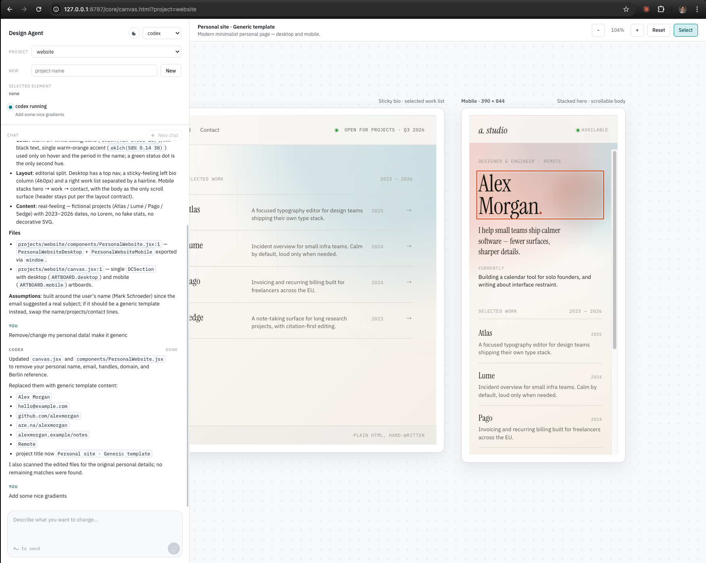

# Canvas Lab

Tiny local design canvas inspired by Claude Design.

Use Codex or Claude Code to wireframe directly in files. The browser is just the viewer: chat on the left, canvas/page preview on the right.



## Start

Double-click `start.command`.

Requirements:

- Python 3 for the local server.
- Codex CLI or Claude Code CLI only if you want the chat to edit files.

Or:

```sh
python3 bridge/server.py
```

Open:

```txt
http://127.0.0.1:8787/core/canvas.html?project=default
```

## Structure

```txt
core/       shared viewer
bridge/     local codex/claude bridge
projects/   design projects
```

Inside a project:

```txt
AGENTS.md
DESIGN.md
canvas.jsx
components/
chats/
```

Agents mostly edit `canvas.jsx` and `components/*.jsx`.

Canvas mode is for flows/variants. Page mode is for one fullscreen responsive page.

Use `Export` in the top bar to download a standalone HTML viewer or open a print/PDF view.
